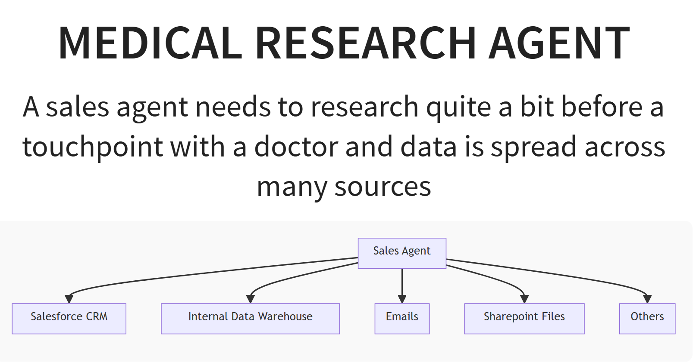
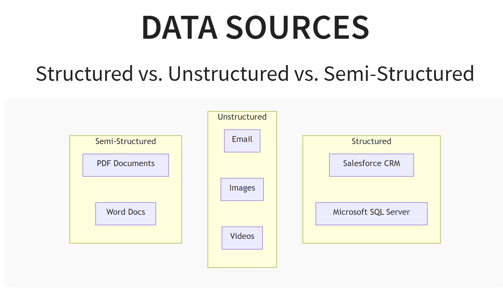

# NPI Research using MCP

  
  

## Opportunities for AI agent(s)
**Human communicates in Natural Language only**  

- Manage and interpret redundant information across sources
- Research, retrieve, summarize, illustrate intel on the doctor from Private and Public Data Sources in real-time
- Fully Automated Natural Language querying on existing IT/Digital/CRM Systems
- Presentation of Data in various formats: slide deck, report, tables, html etc.
- Iterate on specific slides / sections of the report - enhance / cut down / go deeper / go broader / get more creative / get same results every time / options are endless
- Cost of repeating is very low.
- NPI = National Provider Identifier , is a 10-digit numeric identifier to identify healthcare providers (individuals / organizations / institutions)
- MCP = [Model context Protocol](https://modelcontextprotocol.io/introduction)

## What is NPI Researcher
Researching on an NPI can be useful for
- Learning about an NPI in terms of the products and services they provide
- Help connect NPI's of similar nature for research and education
- Help organization conferences to invite as speaker or audience
- Educate PCP and specialists about upcoming drugs, trials and cutting edge research
- Help NPIs write referrals for patients for collaborative well-being of patients
- Since NPI's time is limited (apart from providing care to patients), ensure we can reach out doing as much research as possible upfront (drugs they prescribed, their latest research, historical communication and context etc.)   

**NPI Researcher (this code base) demonstrates how we can achieve many of the above with agentic & MCP technologies by just asking natural language questions**  

- Salesforce CRM mocked as duckdb database (containing nppes data (>10gb) with multiple tables)
- Internal datawarehouse - duckdb demonstrates the same (feel free to add as many mcp servers in .vscode/mcp.json)
- Email - my gmail integrated (see mcp.json and follow instructions [here](https://github.com/GongRzhe/Gmail-MCP-Server))
- Sharepoint filesystem - (
  mimicked with my local folder `/home/ubuntu/Downloads/PradeepDocs`)
- Realtime online search - used tavily-mcp server (see mcp.json file)

## Setup Steps

### IDE, python etc.
- Have python runtime (>3.11)
- Install [uv](https://docs.astral.sh/uv/getting-started/installation/)
- Docker availabe in environment (we will use some mcp servers that run in docker containers below)
- Checkout this repo
- Use Vs Code IDE (that is what I have used)
- From terminal execute, `uv sync` - This will create a .venv folder and install all necessary dependencies (See `pyproject.toml` for details)

### Data
- Download medicare Part D data from [here](https://download.cms.gov/nppes/NPI_Files.html) and extract the contents to `data` folder (create data folder if not already present)
- Use the script [extract_meta](data_etl/data_dict_pdf_to_csv.py) to read pdf file that contains tables/schema definition and extract it into a csv file for e.g. extracted_tables.csv
- `Optional Step for ERD` - As a human, I would like to understand the entity-relationship-diagram of the tables, to be able to validate if the AI is getting me right output, by joining the tables. Use the script `nppes_erd_generator.py` to create a graphviz diagram. Apart from python graphviz package (which is already installed above), you will need graphviz binary and you can install from [here](https://graphviz.org/)
- Execute the section `Create DuckDB database` from the [notebook](data_etl/exploration_to_duckdb.ipynb) - This will create `medicare_data.duckdb` in the same folder

### Agentic System + MCP
- I have used github copilot ($10 per month subscription) & Claude Desktop (free one or $20 per month). You should be fine with any of the other ones like cursor | windsurf | cline etc.
- For VS Code, `.vscode\mcp.json` contains all the mcp server configs
  - `inputs` section to help enter API keys during execution
  - `myduckdb` - mcp server for duckdb (a mimic for CRM)
  - `gmail` - mcp server for reading my email
  - `filesystem` - mcp server for filesystem knowledge
  - `tavily-mcp` - mcp server using tavily for online realtime search (you could swap this for SerperDev or Perplexity)
- For [Claude Desktop](https://claude.ai/download), edit your claude_desktop_config.json accordingly using the above mcp servers

## Example Prompt
Prepare a reveal.js slide deck (graphs, charts, and tables) that provides detailed insights about a doctor: Jorge Sanchez-Masiques with speciality in pulmonary disease, using myDuckDB. The report should include the following sections:

### Section 1 (using DuckDB tool):
- Total claims and total patients treated by year.
- Specialties and drugs prescribed by the doctor.

### Section 2 (using Tavily tool research):
- Related to the drugs prescribed, find papers published by the doctor and list them as bullet points with hyperlinks (search the web using tavily online research).
- List conferences attended with dates and topics.
- Include a word map of keywords found about the doctor's research online.

### Section 3 (using email tool):
- Search my email inbox for keywords: `riociguat`, `PDE5 inhibitor`, and `Endothelin Receptor Antagonist`. Provide a brief summary of the latest two emails for each keyword.

### Section 4 (using my filesystem tool):
- For the keywords: `riociguat`, `PDE5 inhibitor`, and `Endothelin Receptor Antagonist`, search my private knowledge base and list all the file names as a bullet list (do not read the content).

---

### Query:
```sql
SELECT 
    Prscrbr_NPI,
    Prscrbr_Last_Org_Name,
    Prscrbr_First_Name,
    SUM(Tot_Clms) AS Total_Claims,
    COUNT(DISTINCT Brnd_Name) AS Unique_Drugs
FROM medicare_data
WHERE Prscrbr_Type = 'Pulmonary Disease'
GROUP BY Prscrbr_NPI, Prscrbr_Last_Org_Name, Prscrbr_First_Name
ORDER BY SUM(Tot_Clms) DESC
LIMIT 10;
```

### Results:
- **Dr. Jorge Sanchez-Masiques (NPI: 1376541961)**  
  - Total Claims: 67,157  
  - Unique Drugs Prescribed: 58  

- **Dr. James Pike (NPI: 1366443400)**  
  - Total Claims: 45,966  
  - Unique Drugs Prescribed: 308  

- **Dr. Huan Le (NPI: 1780797381)**  
  - Total Claims: 42,483  
  - Unique Drugs Prescribed: 163  

- **Dr. Hossam Amin (NPI: 1437221207)**  
  - Total Claims: 42,111  
  - Unique Drugs Prescribed: 214  

- **Dr. Manoj Majmudar (NPI: 1659336097)**  
  - Total Claims: 38,291  
  - Unique Drugs Prescribed: 330  

- **Dr. Mark Lipham (NPI: 1437192697)**  
  - Total Claims: 32,622  
  - Unique Drugs Prescribed: 249  

- **Dr. Thomas Schneider (NPI: 1003875360)**  
  - Total Claims: 20,506  
  - Unique Drugs Prescribed: 213  

- **Dr. Thomas Chan (NPI: 1548333552)**  
  - Total Claims: 20,409  
  - Unique Drugs Prescribed: 86  

- **Dr. Juan Acevedo-Crespo (NPI: 1720074545)**  
  - Total Claims: 19,261  
  - Unique Drugs Prescribed: 30  

- **Dr. Sergio Martinez (NPI: 1336171040)**  
  - Total Claims: 18,267  
  - Unique Drugs Prescribed: 217  


### Technical
- Install Graphviz tools from [here](https://graphviz.org/download/)